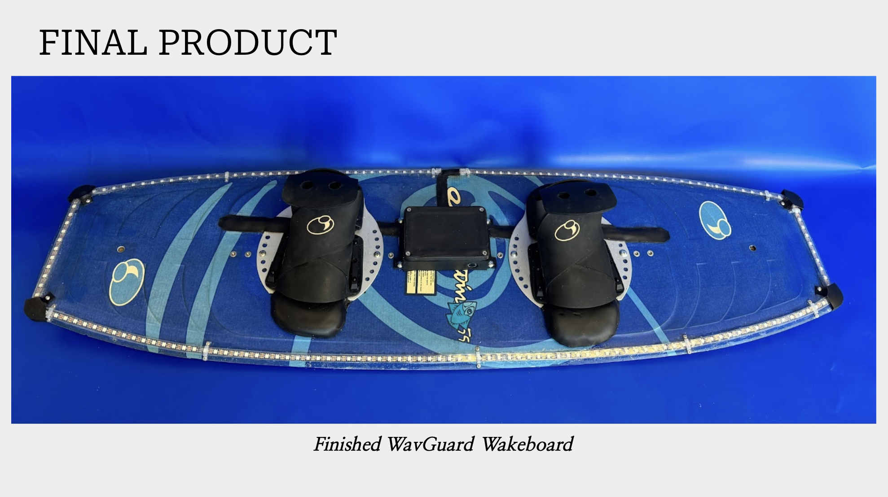
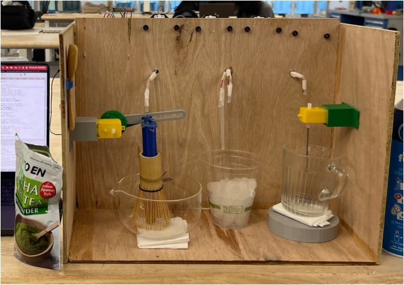
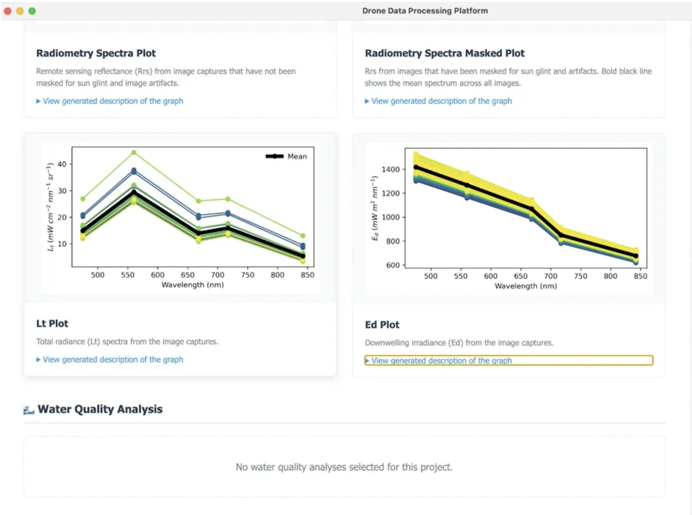

  <h1>Nidhi Khiantani</h1>
  
 Duke University '26

  
Computer Science (ECE Focus) + Theater Studies

---
## About Me

Hello! I’m pursuing a B.S. in Computer Science with an ECE focus + Theater Studies at Duke (‘26) and looking for hardware engineering opportunities where I can design, test and optimize real systems! I began my studies in Computer Science at Duke University and quickly discovered I wanted to physically build as well as code. That led me to focus on embedded systems, sensor integration, and hardware design alongside my CS major.I have designed and developed hardware products, including custom PCBs, microcontroller-based systems (ESP32), sensor arrays (IMU, FSRs), and LED feedback systems. I’ve also executed test plans, validated hardware performance under real-world conditions, and troubleshooted hardware issues.

---
## Featured Projects

  
  

    <h3><a href="projects/wavguard">WavGuard</a></h3>
    
Wakeboard balance training system with FSR sensors, IMU, and real-time LED feedback.

    

      ESP32
      PCB Design
      FSR Sensors
      IMU
    

  

  
  

    <h3><a href="projects/ice-cream-dispenser">Ice Cream Dispenser</a></h3>
    
Custom 32-bit RISC CPU in Verilog controlling automated topping dispenser via memory-mapped I/O.

    

      Verilog
      FPGA
      Assembly
      PWM
    

  

  
  

    <h3><a href="projects/matchamatic">Matchamatic</a></h3>
    
ESP32-powered automated matcha latte maker.

    

      ESP32
      Motor Control
      Web Server
      Calibration
    

  

  
  

    <h3><a href="projects/autonomous-vehicle">Autonomous Navigation Robot</a></h3>
    
Ground-up robot build with LiDAR, RGB camera, and IMU. 

    

      ROS
      LiDAR
      Computer Vision
      Arduino
    

  

  
  

    <h3><a href="projects/dronewq">DroneWQ</a></h3>
    
Electron desktop app for water quality analysis from drone imagery.

    

      Python
      Flask
      Electron
      GDAL
    

  

