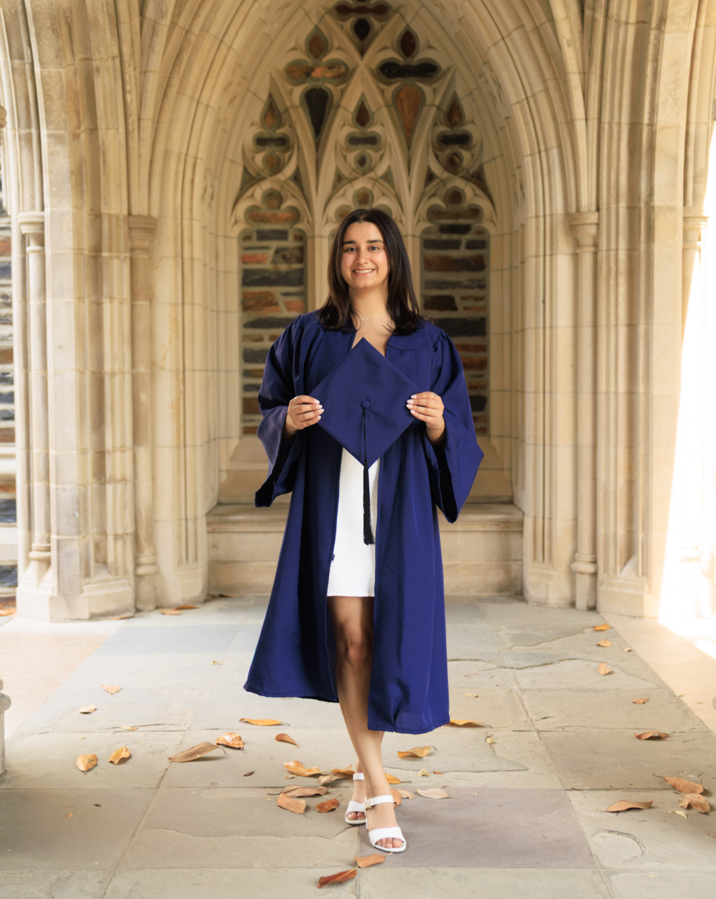
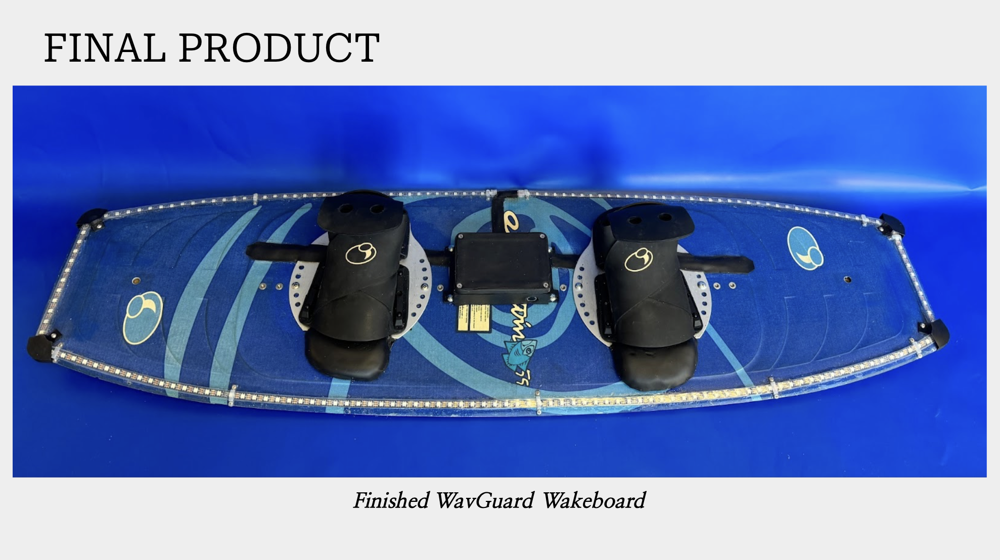
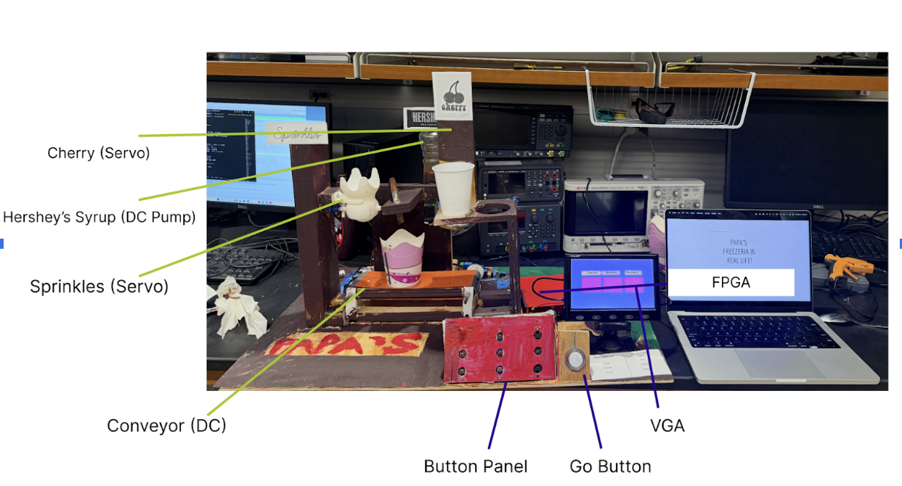
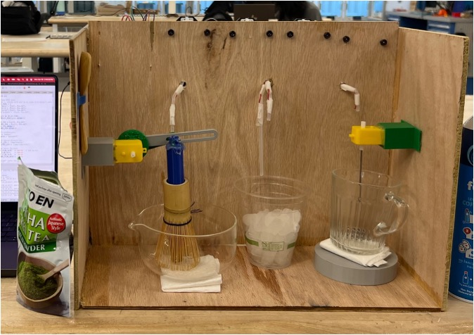
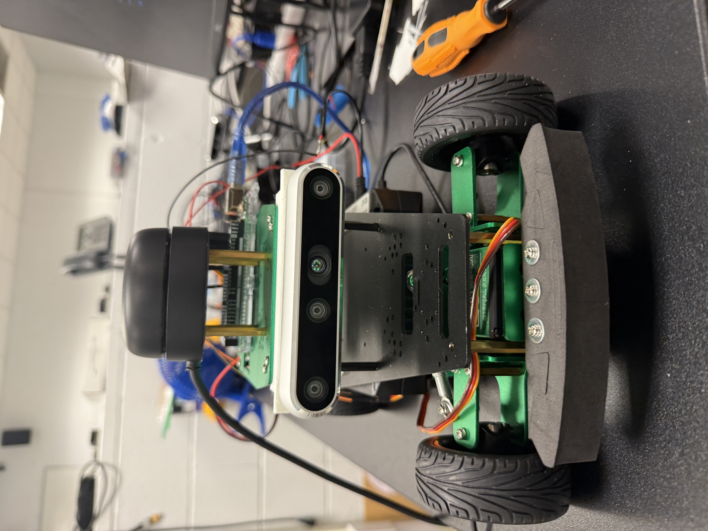
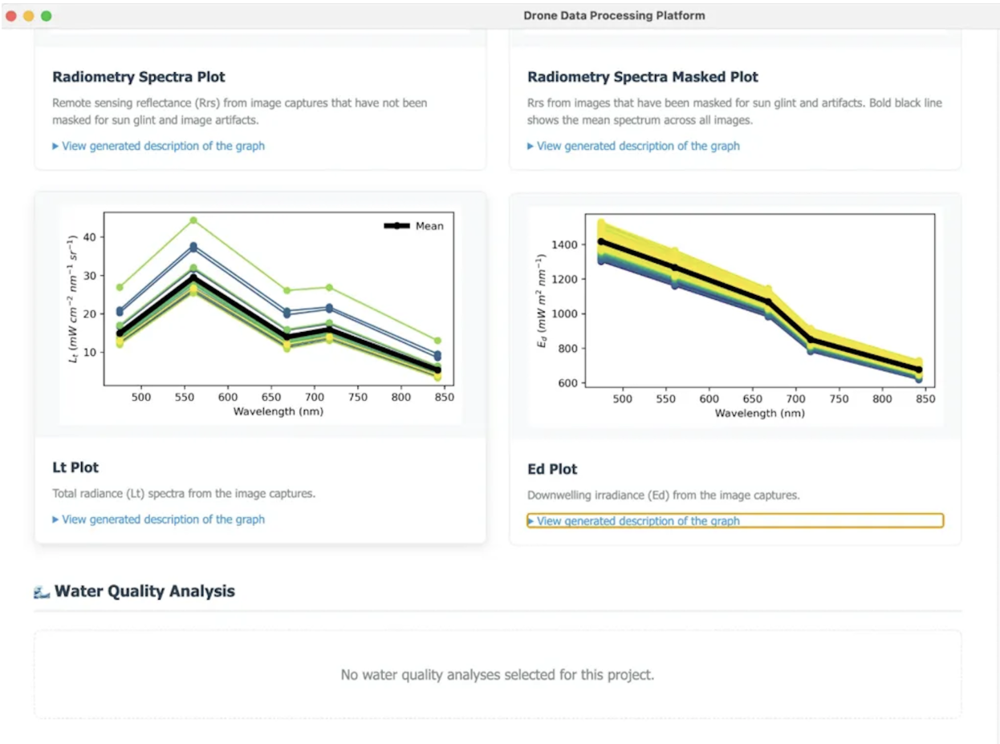

<nav class="main-nav">
  <a href="/" class="active">Home</a>
  <a href="#about">About</a>
  <a href="#projects">Projects</a>
  <a href="#skills">Skills</a>
  <a href="#contact">Contact</a>
</nav>

  

    

      
    

    

      <h1>Nidhi Khiantani</h1>
      
Duke University '26 · University of Michigan MEng '27

      
B.S. Computer Science & ECE + Theater Studies · MEng ECE, Autonomous Systems Concentration

      
<strong>Relevant Coursework:</strong> Digital Systems, IoT Systems, Electrical and Computer Engineering Fundamentals, Advanced Data Structures and Algorithms, Product Design, Computer Systems, Discrete Math

      
      

        <a href="resume.pdf" class="btn-primary" target="_blank">View My Resume</a>
      

    

    
    

      
    

  

## About Me

Hello! I recently graduated from Duke University with a B.S. in Computer Science (ECE focus) and Theater Studies, and I'm heading to the University of Michigan for a Master of Engineering in ECE with a concentration in Autonomous Systems. I'm looking for hardware engineering opportunities where I can design, test, and optimize real systems! I began my studies in Computer Science at Duke and quickly discovered I wanted to physically build as well as code. That led me to focus on embedded systems, sensor integration, and hardware design. I have designed and developed hardware products, including custom PCBs, microcontroller-based systems (ESP32), sensor arrays (IMU, FSRs), and FPGA development. I've also executed test plans, validated hardware performance under real-world conditions, and troubleshooted hardware issues.

## Projects

  
  

    <h3><a href="projects/wavguard">WavGuard</a></h3>
    
Wakeboard balance training system with FSR sensors, IMU, and real-time LED feedback.

    

      ESP32
      PCB Design
      FSR Sensors
      IMU
    

  

  
  

    <h3><a href="projects/ice-cream-dispenser">Ice Cream Dispenser</a></h3>
    
Custom 32-bit RISC CPU in Verilog controlling automated topping dispenser via memory-mapped I/O.

    

      Verilog
      FPGA
      Assembly
      PWM
    

  

  
  

    <h3><a href="projects/matchamatic">Matchamatic</a></h3>
    
ESP32-powered automated matcha latte maker.

    

      ESP32
      Motor Control
      Web Server
      Calibration
    

  

  
  

    <h3><a href="projects/CPSL">IcaRAus: Radar-Based Robot Navigation</a></h3>
    
Co-authored IEEE T-RO paper on GNN-enhanced radar point clouds for autonomous UGV and UAV navigation.

    

      ROS2
      mmWave Radar
      SLAM
      Nav2
    

  

  
  

    <h3><a href="projects/autonomous-vehicle">Autonomous Navigation Robot</a></h3>
    
Ground-up robot build with LiDAR, RGB camera, and IMU.

    

      ROS
      LiDAR
      Computer Vision
      Arduino
    

  

  
  

    <h3><a href="projects/dronewq">DroneWQ</a></h3>
    
Electron desktop app for water quality analysis from drone imagery.

    

      Python
      Flask
      Electron
      GDAL
    

  

## Skills

**Hardware Design & Testing:** PCB Design (KiCad), FPGA Development (Vivado), Circuit Design, Oscilloscope, Logic Analyzer, Multimeter, Soldering, Hardware Debugging, Testing & Validation, Signal Processing

**Embedded Systems & Firmware:** Arduino, ESP32 (S2/S3), STM32, Raspberry Pi, Jetson AGX Xavier, Nexys A7 FPGA

**Protocols & Interfaces:** I²C, SPI, UART, PWM, Memory-Mapped I/O

**HDL & Programming:** Verilog, C/C++, Python (NumPy, Pandas, PyTorch), Java, MATLAB, MicroPython, Assembly (MIPS)

**Software & Development Tools:** Git, Linux, ROS2, Flask, Node.js, HTML/CSS, Google Cloud, Electron, Docker

**CAD & Design:** Figma, Onshape, KiCad, 3D Printing

**Robotics & Computer Vision:** LiDAR, RealSense RGB-D Camera, YOLO, Sensor Fusion, Dataset Creation

## Contact

**Email:** nkhian@umich.edu  
**LinkedIn:** [linkedin.com/in/nidhi-khiantani](https://linkedin.com/in/nidhi-khiantani)

