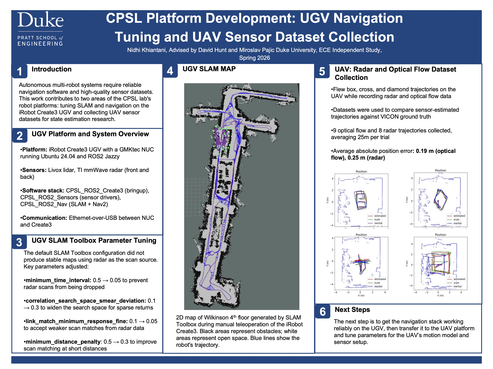
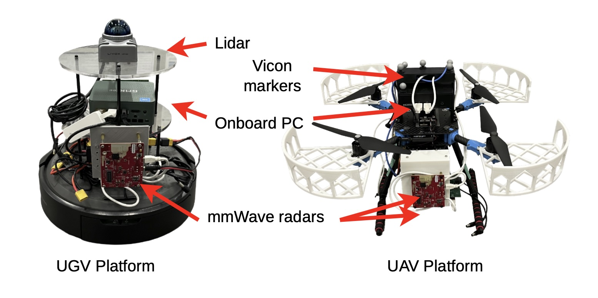
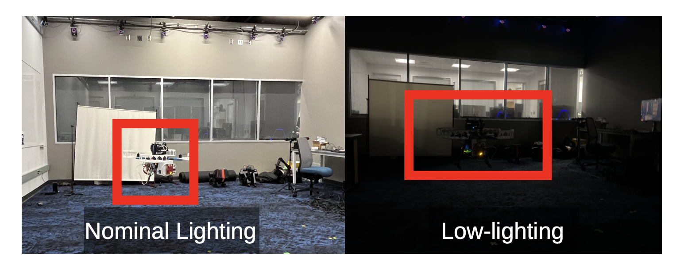

[← Back to Portfolio](https://nidhi-k3.github.io/)

# IcaRAus: Radar-Based Autonomous Navigation for UGVs and UAVs

 *Research poster presented at Duke University, Spring 2026*

---

## Overview

I worked in Duke's Cyber-Physical Systems Lab (CPSL) on IcaRAus — a graph neural network framework that cleans up sparse mmWave radar point clouds so ground and aerial robots can navigate autonomously without needing LiDAR or cameras. I'm a co-author on the paper submitted to IEEE Transactions on Robotics (T-RO).

My contributions fell into two tracks: tuning the SLAM and navigation stack on the lab's UGV, and collecting UAV flight datasets to benchmark radar vs. optical flow for state estimation.

**Technologies:** ROS2 Jazzy, SLAM Toolbox, Nav2, TI mmWave radar (IWR1843, IWR6843-ODS), Livox LiDAR, iRobot Create3, Holybro X500 V2 UAV, PX4, VICON motion capture, Python, Ubuntu 24.04

| **Timeline:** Spring 2026 | **Lab:** CPSL, Duke University |
| --- | --- |
| **Advisors:** David Hunt, Miroslav Pajic | **Publication:** IEEE T-RO (submitted) |

---

## The Problem

LiDAR is expensive, heavy, and power-hungry. Cameras fail in low light. MmWave radar is cheap, lightweight, and works in any visibility — but its point clouds are extremely sparse (~90% fewer points than 2D LiDAR) and over 50% of detections can be multipath artifacts. IcaRAus uses a tiny 45.8K-parameter GNN running in under 10ms on an edge CPU to filter out the noise and densify the data for real-time SLAM and navigation.

---

## The Platforms

 *UGV (iRobot Create3) and UAV (Holybro X500 V2) used for real-world experiments. Both equipped with dual TI-IWR1843 mmWave radars, onboard PCs, and VICON markers for ground truth.*

---

## What I Did

### UGV SLAM Parameter Tuning

The default SLAM Toolbox config was built for LiDAR and didn't work with radar. I tracked down the issues and tuned four key parameters:

| Parameter | Default → Tuned | Why |
| --- | --- | --- |
| `minimum_time_interval` | 0.5 → 0.05 | Radar scans were being silently dropped |
| `correlation_search_space_smear_deviation` | 0.1 → 0.3 | Wider search space for sparse returns |
| `link_match_minimum_response_fine` | 0.1 → 0.05 | Accept weaker matches from noisy radar |
| `minimum_distance_penalty` | 0.5 → 0.3 | Better matching at short distances |

After tuning, the UGV generated stable 2D maps of Wilkinson 4th floor using radar only — no LiDAR.

**Platform:** iRobot Create3 with GMKtec NUC (Intel N100), dual TI-IWR1843 radars (front/back), Livox MID-360 LiDAR (ground truth only). Software stack: CPSL_ROS2_Create3, CPSL_ROS2_Sensors, CPSL_ROS2_Nav.

### UAV Dataset Collection

I flew box, cross, and diamond trajectories on the UAV while recording from both the mmWave radar and an ARK Flow optical flow sensor. VICON motion capture provided sub-millimeter ground truth.

 *UAV testing under nominal lighting (left) and low-light conditions (right). Radar performance stayed stable in both; optical flow degraded significantly in the dark.*

**Collected:** 9 optical flow + 8 radar trajectories, averaging 25m per trial

| Sensor | Avg. Position Error |
| --- | --- |
| Optical Flow | 0.19 m |
| Radar | 0.25 m |

Radar came within 6cm of optical flow — and in low-light tests, optical flow velocity error nearly doubled while radar stayed stable.

---

## Paper Results (Full IcaRAus System)

The overall framework (GNN + velocity estimation + SLAM/Nav2) achieved across four indoor environments:

- **15cm** average localization error (within 27cm 90% of the time)
- **0.22m** mean Chamfer distance for point cloud quality (1.7× better than next best baseline)
- **Collision-free navigation** on 75m+ trajectories on both UGV and UAV
- **Stable performance in total darkness** where optical flow fails

---

## What I Learned

The biggest lesson was debugging silent failures in ROS2. The QoS mismatch I found — where the radar driver and SLAM Toolbox used incompatible Quality of Service settings, causing scans to be dropped without any error — was the kind of thing that just makes your maps look bad with no obvious explanation. Learning to diagnose that was really valuable.

Working with radar data also changed how I think about sensors. With LiDAR you get thousands of clean points. With radar you get ~80-100 points per frame and half are fake. Every downstream algorithm has to account for that.

This was also my first co-authored publication, which taught me about experimental methodology — flying consistent trajectories, synchronizing multi-sensor timestamps, and benchmarking against ground truth systems.

---

## Skills Demonstrated

- ROS2 system integration — SLAM Toolbox, Nav2, QoS debugging, sensor drivers
- Parameter tuning — adapting navigation stacks for non-standard sensor inputs
- Sensor systems — mmWave radar, LiDAR, optical flow, IMU, VICON
- Dataset collection — structured flight patterns, multi-sensor synchronization
- Embedded platforms — iRobot Create3, PX4/Pixhawk, Intel NUC
- Research — co-authored IEEE T-RO paper, poster presentation

---

[← Back to Portfolio](https://nidhi-k3.github.io/)
