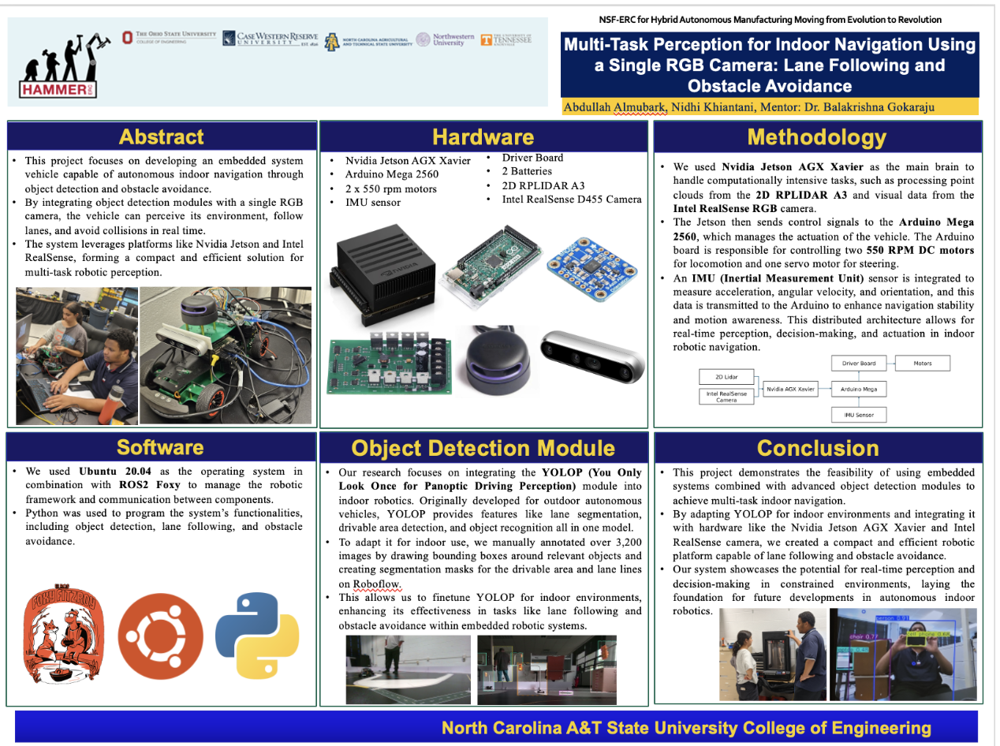
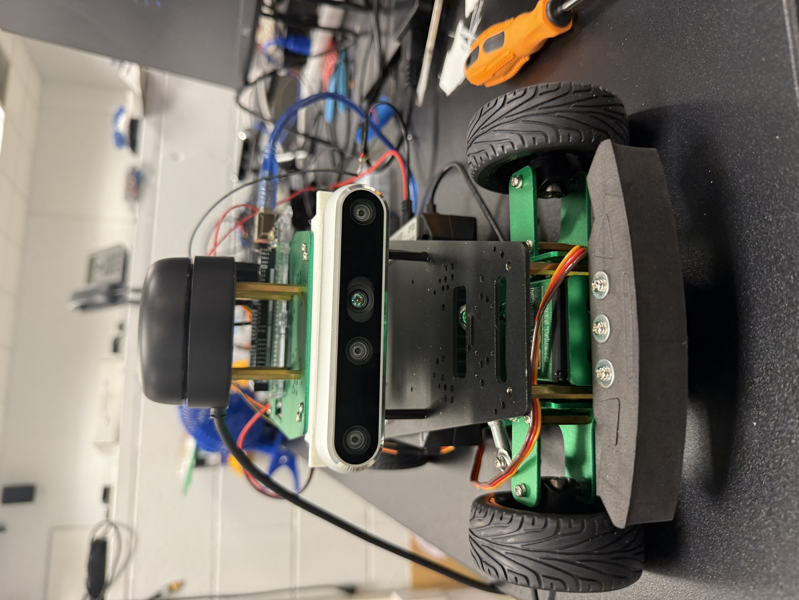
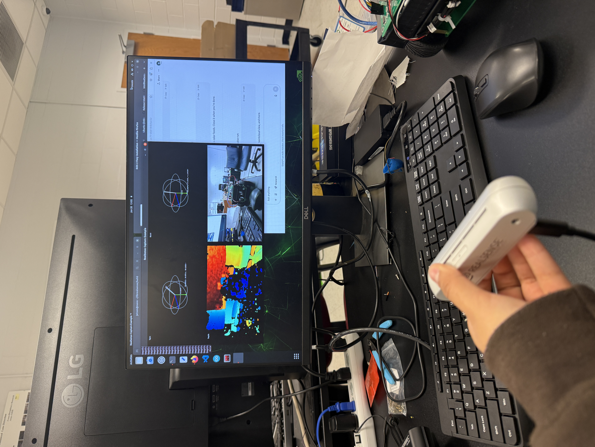
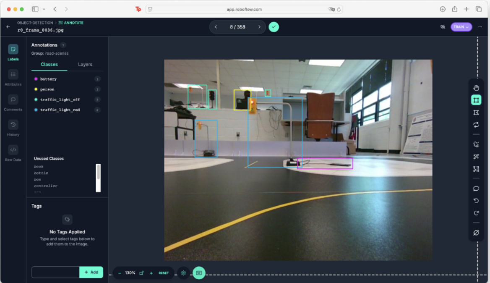
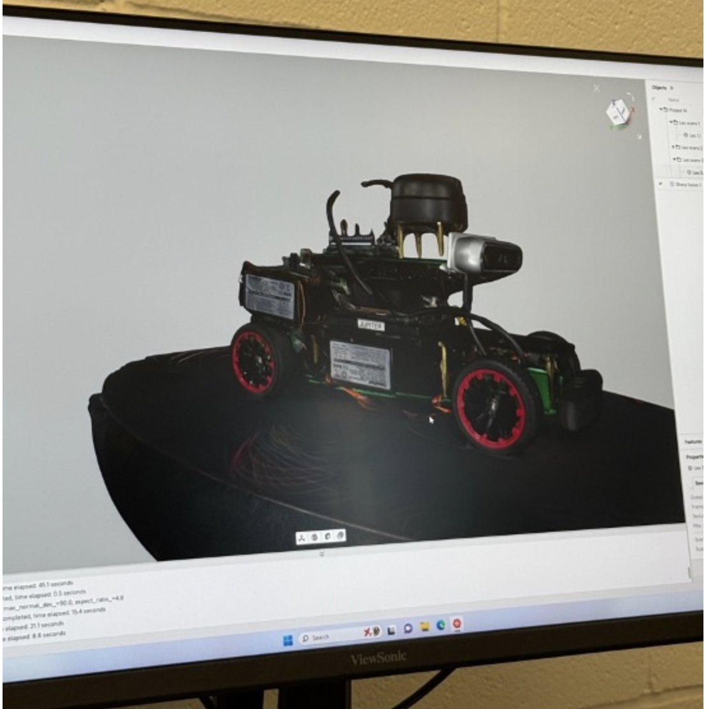

<link rel="stylesheet" type="text/css" href="style.css">
# Autonomous Indoor Navigation Robot

*Project poster presented at NC A&T*

---

## What I Built

During my summer 2024 internship at the CABS Lab (Center for Advanced Transportation Mobility) at North Carolina A&T State University, we designed and built an autonomous indoor navigation robot from the ground up. The robot uses a differential drive system with multiple sensors (2D LiDAR, RGB-D camera, IMU) integrated with ROS (Robot Operating System) for autonomous navigation and obstacle avoidance. We handled the complete build, from mechanical assembly and electronics wiring to sensor calibration, software integration, and custom dataset creation for training a multi-task computer vision model.

**Technologies:** Arduino Mega, dual H-bridge motor driver, RP LIDAR A3, Intel RealSense RGB-D camera, Bosch BNO055 IMU, NVIDIA Jetson (ROS), PWM motor control, I²C communication, differential drive kinematics, YOLOv5/YOLO-P object detection, TensorRT optimization, Roboflow dataset management

**Timeline:** Summer 2024 | **Organization:** CABS Lab @ NC A&T State University

---

## Project Goal

The goal was to build a modular autonomous robot platform for indoor navigation research. The robot needed to:
- Navigate autonomously through indoor environments
- Detect and avoid obstacles in real-time
- Integrate multiple sensor modalities (vision, depth, laser scanning)
- Serve as a research platform for testing perception and navigation algorithms

This was a complete ground-up build - we assembled the chassis, wired all electronics, calibrated sensors, integrated everything with ROS, and created a custom dataset for training an indoor-adapted computer vision model.

---

## System Architecture

### Hardware Components

**Differential Drive Chassis:**
- 2 rear DC motors (6-12V) for independent wheel control
- 2 front caster wheels (passive, free-spinning)
- Aluminum chassis with pre-drilled mounting slots

**Control Electronics:**
- **Arduino Mega** - low-level motor control and sensor interfacing
- **Dual H-bridge motor driver** - amplifies Arduino PWM signals to drive motors
- **NVIDIA Jetson** - runs ROS, perception algorithms (YOLOv5/YOLO-P), high-level planning
- 2 separate battery packs (one for motors, one for Jetson/Arduino)

**Sensors:**
- **RP LIDAR A3** - 2D 360° laser scanner (~10 Hz, 0.1° resolution) for mapping and collision avoidance
- **Intel RealSense RGB-D camera** - synchronized color and depth images for object detection and dataset collection
- **Bosch BNO055 IMU** - 9-axis sensor with onboard fusion for orientation tracking

*Assembled robot with LiDAR, RealSense camera, and electronics stack*

### Software Architecture

The system splits perception and control across two processors:

**Jetson (High-Level):**
- Runs ROS nodes for sensor data processing
- YOLOv5/YOLO-P object detection (TensorRT optimized on GPU)
- Obstacle avoidance decision logic
- Publishes velocity commands to `/cmd_vel` topic

**Arduino (Low-Level):**
- Receives velocity commands via USB serial (ROS serial bridge)
- Converts commands to PWM signals for motor speed control
- Reads IMU data via I²C and publishes orientation
- Direct hardware control loop (~1 kHz)

This separation makes debugging easier - perception bugs don't crash motor control, and vice versa.

---

## How We Built It

### Mechanical Assembly

We assembled the chassis with vibration control in mind:
- Mounted electronics on **standoffs** (threaded spacers) to prevent shorts and reduce vibration
- Used **rubber grommets** under LiDAR and IMU to dampen high-frequency vibrations that cause noisy readings
- Positioned sensors for optimal coverage - LiDAR on top for 360° view, RealSense front-center angled slightly down

**Differential drive kinematics:**
- Two rear motors provide all propulsion
- Robot turns by running wheels at different speeds (or opposite directions for in-place rotation)
- Front casters passively follow, bearing weight but not driven
- Achieves ~0.2-0.5 m/s top speed for safe indoor navigation

### Motor Control Circuit

The motor driver has separate **logic** and **power** sections that I had to wire carefully:

**Motor connections:**
- Motor A (left wheel) → M1+, M1-
- Motor B (right wheel) → M2+, M2-
- Reversing polarity flips motor direction

**Control signals from Arduino:**
- **ENA (pin D5)** - PWM for Motor A speed
- **ENB (pin D6)** - PWM for Motor B speed
- **IN1/IN2 (pins D22/D23)** - Motor A direction (forward: IN1=HIGH, IN2=LOW)
- **IN3/IN4 (pins D24/D25)** - Motor B direction

**Power wiring:**
- Battery positive → motor driver **VCC**
- Battery negative → motor driver **GND (power side)**
- **Critical:** Also connect motor driver logic GND to Arduino GND for common reference
- **Always connect logic GND first, then VCC** to avoid voltage spikes

**PWM for motor control:** PWM (Pulse-Width Modulation) lets the Arduino vary motor speed by rapidly switching between HIGH (5V) and LOW (0V). The duty cycle (percentage of time HIGH) determines average voltage - higher duty cycle = faster motor. This is necessary because microcontrollers can't output true analog voltages.

### IMU Integration

The **Bosch BNO055** has onboard sensor fusion, so it outputs calibrated orientation data (Euler angles or quaternions) directly - no need for me to implement filtering algorithms.

**Wiring:**
- SDA → Arduino D20 (I²C data)
- SCL → Arduino D21 (I²C clock)
- VDD → 3.3V
- GND → common ground

**Calibration process:** I ran the Adafruit BNO055 calibration sketch and moved the sensor through figure-eights and rotations. The chip stores calibration status internally, and I saved the offsets to EEPROM so I don't have to recalibrate after power cycles.

I mounted the IMU near the chassis center to minimize rotational noise.

### Sensor Calibration

Getting accurate sensor data required both **intrinsic** and **extrinsic** calibration:

**Intrinsic calibration** (correcting sensor imperfections):
- **Camera:** Used OpenCV checkerboard calibration with 15-30 images at varying angles to compute lens distortion coefficients and focal lengths
- **IMU:** Measured raw accelerometer/gyro outputs while stationary to find constant biases, then subtracted them in code
- **LiDAR:** Minimal intrinsic calibration needed (factory calibrated), but verified angular resolution

**Extrinsic calibration** (aligning multiple sensors):
- **Camera ↔ LiDAR:** Placed a checkerboard visible to both sensors, recorded synchronized data, then ran ROS `camera_lidar_calibrator` package to compute the precise translation and rotation between them
- Stored all calibration parameters in YAML files that ROS nodes load automatically at startup

**Why calibration matters:** Even with a single sensor, intrinsic calibration is critical. A tilted, uncalibrated camera will misinterpret floor planes and obstacle heights. For sensor fusion, bad extrinsics mean the LiDAR and camera data won't align, causing false obstacle detections.

### ROS Integration

I set up a ROS-based software stack on the Jetson:

**Sensor nodes:**
- `rplidar_ros` - publishes laser scans to `/scan` topic
- `realsense2_camera` - publishes RGB and depth images
- `imu_node` - reads BNO055 data from Arduino and publishes orientation

**Perception node:**
- Runs YOLOv5 (optimized with TensorRT for GPU acceleration)
- Detects objects in camera images, publishes bounding boxes to `/detections`
- Extracts depth values for each detection from RealSense depth image to compute distance

**Decision node:**
- Subscribes to `/detections` and `/scan`
- Runs obstacle avoidance logic (e.g., "if obstacle <0.5m ahead, stop and turn")
- Publishes velocity commands (`linear.x`, `angular.z`) to `/cmd_vel`

**Arduino bridge:**
- `rosserial` node forwards `/cmd_vel` messages to Arduino via USB serial
- Arduino converts velocity commands to individual motor PWM values and direction signals

*RViz showing sensor data and object detection*

---

## YOLO-P Model Training for Indoor Environments

A major focus of my internship was **adapting the YOLO-P model for indoor autonomous navigation**. YOLO-P is a multi-task computer vision model that performs three simultaneous tasks:

1. **Object detection** - identifying obstacles (people, robots, boxes, etc.)
2. **Drivable area segmentation** - determining which floor areas are safe to drive on
3. **Lane detection** - identifying lane boundaries

**The challenge:** YOLO-P was originally trained on outdoor autonomous driving datasets (like BDD100K). My task was to create a custom indoor dataset and demonstrate that YOLO-P could be adapted for indoor environments.

### Dataset Collection

I collected **~4,000 frames** by driving the robot around an indoor track while recording with the Intel RealSense camera. To ensure dataset diversity, I:

**Varied environmental conditions:**
- Lights on/off
- Window blinds up/down
- Different times of day for varying natural lighting

**Placed diverse objects along the track:**
- Other robots
- People
- Boxes and books
- Traffic markers
- Stop lights
- Bottles
- Various other obstacles

This diversity was critical - the model needs to generalize across different lighting conditions and object types it might encounter in real indoor environments.

*Annotating indoor dataset in Roboflow*

### Dataset Organization and Annotation

I uploaded all frames to **Roboflow** and organized them into **three separate projects** corresponding to YOLO-P's three tasks:

1. **Object Detection project** - for labeling bounding boxes around obstacles
2. **Lane Detection project** - for annotating lane boundaries
3. **Drivable Area Segmentation project** - for segmenting floor regions safe for navigation

I also integrated frames from previously recorded videos from another vehicle, cleaning and adding them to expand the dataset further.

**Annotation workflow:**
- Used Roboflow's annotation tools to label objects, lane lines, and drivable areas
- Ensured consistent labeling conventions across all frames
- Split data into train/val/test sets (typical 70/20/10 split)

### Why Multi-Task Learning?

YOLO-P's multi-task architecture is particularly valuable for autonomous navigation because:
- **Shared feature extraction** - the backbone network learns features useful for all three tasks, making it more efficient than running three separate models
- **Complementary information** - object detection finds obstacles, lane detection provides path guidance, and drivable area segmentation identifies traversable regions
- **Single inference pass** - all three outputs in one forward pass (~15 FPS on Jetson), much faster than sequential models

### Integration with Robot System

The trained YOLO-P model was designed to replace the standard YOLOv5 object detection node in our ROS pipeline:

**Original pipeline:**
- YOLOv5 → object bounding boxes only
- Separate lane detection algorithm needed
- No explicit drivable area segmentation

**YOLO-P pipeline:**
- Single model outputs all three tasks
- More efficient GPU utilization
- Richer semantic understanding of the scene

I optimized the model with **TensorRT** for fast inference on the Jetson GPU.

### Results

**Dataset collection:** Successfully collected 4,000 diverse indoor frames under varying conditions

**Model training:** Annotation and training were in progress at the end of the internship

**Integration challenge:** While YOLO-P was designed to improve lane following by providing explicit lane detection output, we didn't get to fully test this because lane following control remained unstable. The obstacle detection portion worked well with the existing YOLOv5, but we didn't have time to validate whether YOLO-P's lane detection would solve the control issues.

**Key insight:** Even with perfect perception (knowing exactly where lanes are), you still need robust control algorithms to actually follow them. YOLO-P addresses the perception side, but our lane following failure was likely more of a control problem.

---

## How It Works

1. Sensors continuously stream data to Jetson via USB
2. YOLOv5 detects objects in camera frames, depth camera measures distances
3. LiDAR provides 360° obstacle map
4. Decision node analyzes sensor data and determines safe velocities
5. Velocity commands sent to Arduino via ROS serial
6. Arduino converts commands to PWM (motor speed) and direction signals (IN1-IN4)
7. H-bridge driver amplifies signals and drives motors
8. Robot moves, sensors update, cycle repeats at ~10 Hz

---

## Results

The robot successfully performed **real-time obstacle detection and stopping** - when the sensors detected an object within the threshold distance (~0.5m), the robot would halt to avoid collision. However, **autonomous lane following was not achieved** during the internship period.

**What worked:**
- Obstacle detection: LiDAR and RealSense successfully detected objects and measured distances
- Emergency stop: Robot reliably stopped when obstacles entered the safety zone
- Sensor integration: All sensors (LiDAR, depth camera, IMU) streamed data to ROS successfully
- YOLOv5 object detection: Ran at ~15 FPS on Jetson GPU and identified objects in camera feed
- Motor control: Arduino reliably converted velocity commands to motor movements
- Dataset collection: Successfully gathered 4,000 diverse indoor frames for YOLO-P training

**What didn't work:**
- Lane following algorithm failed to keep robot centered in hallway
- Path tracking was unstable - robot would drift or overcorrect

**Performance metrics:**
- Obstacle detection range: 0.5-8 meters (LiDAR), 0.3-3 meters (RealSense)
- Navigation speed: 0.2-0.4 m/s (safe for indoor environment)
- YOLOv5 inference: ~15 FPS on Jetson GPU
- Motor control loop: ~1 kHz on Arduino

*3D scan of the completed robot platform*

---

## What I Learned

This project taught me that **building a robot that moves is very different from building a robot that navigates autonomously**. Getting obstacle detection working (stop when object detected) was achievable, but lane following requires both good perception AND good control working together.

**On the perception side,** I learned about multi-task learning and how models like YOLO-P can share representations across related tasks. Creating a quality dataset is time-consuming but critical - garbage in, garbage out. I got hands-on experience with the full ML pipeline: data collection, annotation, dataset organization, and model optimization (TensorRT).

**On the control side,** I learned about the gap between perception and control. Even if our sensors could see the lane lines perfectly (which YOLO-P was designed to provide), translating that into smooth steering commands proved much harder than expected. This taught me that autonomous systems need both components working well.

**Hardware integration** taught me that good wiring and grounding are critical - noise in sensor data makes control algorithms fail even if they're theoretically correct. Common grounding and vibration dampening made a huge difference in sensor stability.

I also learned about **realistic project scoping**. We accomplished the hardware build, sensor integration, dataset collection, and basic obstacle avoidance, but autonomous navigation is a much bigger problem than one summer internship. In a professional setting, I'd now know to break this into smaller milestones.

The **ROS architecture** made debugging possible. When lane following failed, I could visualize sensor data in RViz, check which node was publishing bad data, and isolate whether the problem was perception or control. Without that modularity, debugging would have been impossible.

---

## Skills Demonstrated

- Embedded systems - Arduino programming, I²C communication, PWM generation
- Power electronics - H-bridge motor drivers, dual battery systems, common grounding
- Sensor integration - LiDAR, RGB-D camera, IMU interfacing and calibration
- ROS - Topic pub/sub, sensor drivers, perception nodes, rosserial Arduino bridge
- Computer vision - YOLOv5 deployment, custom dataset creation, data annotation
- Machine learning - Multi-task learning (YOLO-P), transfer learning, dataset curation
- Model optimization - TensorRT conversion for edge deployment on Jetson
- Dataset management - Roboflow workflows, train/val/test splits, annotation quality control
- Robotics fundamentals - Differential drive kinematics, obstacle avoidance, sensor fusion
- System integration - Combining mechanical, electrical, and software subsystems
- Debugging - Systematic troubleshooting across hardware and software layers
- Calibration - Intrinsic and extrinsic sensor calibration workflows

---

[← Back to Portfolio](../README.md)
