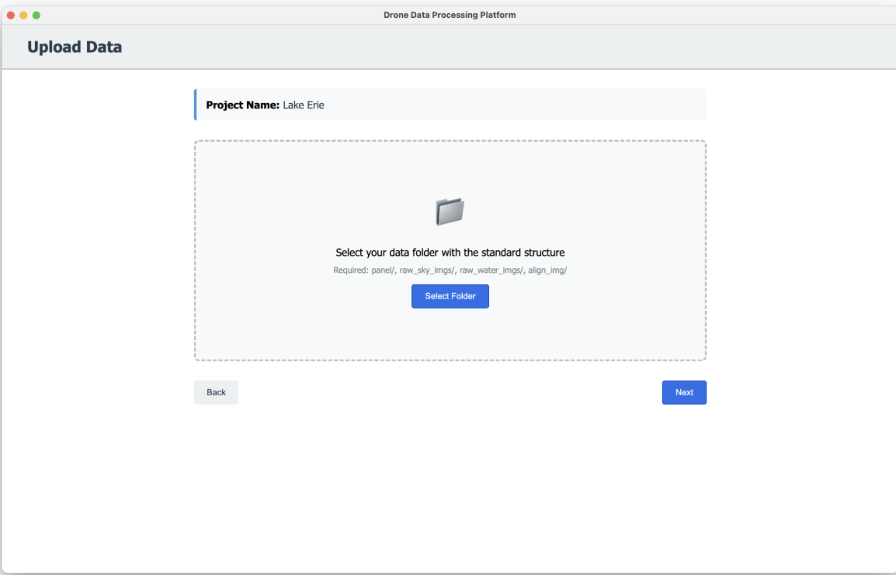

<link rel="stylesheet" type="text/css" href="style.css">

# DroneWQ: Desktop Application for Water Quality Analysis from Drone Imagery


*Folder selection screen with validation*

---

## What I Built

As part of a semester-long software engineering project (August-December 2024), I led backend development and code refactoring for DroneWQ - an Electron-based desktop application that analyzes multispectral drone imagery to assess water quality. The application processes images from MicaSense RedEdge and Altum cameras to derive ocean color radiometry and calculate water quality parameters like chlorophyll-a concentration and total suspended matter. Our team successfully delivered a production-ready application with comprehensive documentation to our clients for submission to the Journal of Open Source Software (JOSS).

**Technologies:** Python, Flask, SQLite, Electron, JavaScript (vanilla), HTML/CSS, GDAL, NumPy, Pandas, Matplotlib, Cartopy, PyPI packaging, Git

**Timeline:** August - December 2024 (full semester) | **Team size:** 3 people

**Role:** Backend lead - refactored existing Python codebase, built Flask API server, implemented processing pipeline, wrote comprehensive technical documentation

---

## Project Goal

The goal was to refactor an existing research codebase into a production-quality desktop application suitable for publication in JOSS (Journal of Open Source Software). The original DroneWQ Python package worked but had messy, undocumented code that wasn't maintainable or user-friendly. Our client (a research team) needed:

1. Clean, modular codebase meeting JOSS standards
2. Desktop GUI application for non-technical users (environmental scientists, citizen scientists)
3. Comprehensive documentation (user guide, technical docs, API docs)
4. Automated testing and continuous integration
5. PyPI package for easy installation

---

## Technical Architecture

### System Overview

DroneWQ uses an Electron + Flask architecture:

**Frontend (Electron):**
- Desktop application (cross-platform: Mac, Linux, Windows)
- Vanilla JavaScript (no frameworks, keep it lightweight)
- Handles UI, file selection, project management
- Communicates with Flask backend via REST API

**Backend (Flask + Python):**
- Flask server running locally on localhost:8889
- Processes drone imagery using DroneWQ Python package
- SQLite database for project management
- Writes results to user-selected project folders

**Why this architecture?**
- Familiar tech stack - team had experience with Electron and Python
- Cross-platform - Electron targets Mac/Windows/Linux
- Local processing - no cloud dependency, all data stays on user's machine
- Modular - backend can be used independently via command line

### Processing Pipeline

The water quality analysis follows this pipeline:
```
Raw Drone Images
    ↓
1. Lt (Total Radiance) - Convert raw pixels to radiance values
    ↓
2. Lw (Water-Leaving Radiance) - Remove sky reflection/glint
    ↓
3. Rrs (Remote Sensing Reflectance) - Normalize by downwelling irradiance
    ↓
4. Water Quality Parameters - Apply bio-optical algorithms
    ↓
Results: Chlorophyll-a, Total Suspended Matter, etc.
```

**Key processing methods:**
- Sky glint removal: Mobley rho, Hedley, Black pixel
- Irradiance calculation: DLS sensor, calibration panel, combined
- Masking: Remove glint, shadows, vegetation using NIR/Green thresholds
- Parallel processing: Multi-threaded image processing for speed

---

## My Contributions

### 1. Backend Refactoring

The original codebase was a research prototype - functional but unmaintainable. I refactored it to meet JOSS publication standards.

**Problems with original code:**
- Monolithic functions (500+ lines)
- No error handling
- Hardcoded paths everywhere
- No separation of concerns
- Inconsistent naming conventions
- Missing docstrings

**What I did:**

**Modularized the pipeline** - broke down monolithic functions into small, single-responsibility modules:
- `dronewq.core` - main processing pipeline
- `dronewq.lw_methods` - sky reflection removal methods
- `dronewq.ed_methods` - irradiance calculation methods
- `dronewq.masks` - pixel masking logic
- `dronewq.core.wq_calc` - water quality algorithms
- `dronewq.core.georeference` - spatial referencing
- `dronewq.core.mosaic` - image stitching

**Added comprehensive error handling** - try/except blocks with informative error messages for common failures (missing files, invalid folder structure, corrupted images)

**Implemented configuration management** - replaced hardcoded paths with user-configurable settings

**Wrote docstrings** for every function following NumPy doc style

**Type hints** - added type annotations for better IDE support and catching bugs

### 2. Flask API Development

I built the Flask REST API that bridges the frontend and the DroneWQ Python package.

**API Endpoints I implemented:**

**Project Management:**
- `GET /api/projects` - List all projects
- `GET /api/projects/{id}` - Get project details
- `POST /api/projects/new` - Create new project with settings
- `POST /api/projects/update` - Update project settings
- `DELETE /api/projects/{id}/delete` - Delete project
- `POST /api/projects/check_folder` - Validate folder structure

**Processing:**
- `GET /api/process/new/{id}` - Process new project (full pipeline)
- `GET /api/process/updated/{id}` - Reprocess with new settings (WQ only)
- `POST /api/process/mosaic` - Generate georeferenced mosaic
- `POST /api/plot/wq` - Regenerate water quality plots with custom ranges

**Health Check:**
- `GET /health` - Backend readiness check

**Key design decisions:**
- RESTful conventions - used proper HTTP verbs and status codes
- JSON responses - consistent response format with error messages
- Async processing - long-running tasks don't block the API
- Validation - input validation before processing to catch errors early

### 3. SQLite Database Design

I designed the SQLite schema for managing project instances.

**Projects table:**
```sql
CREATE TABLE projects (
    id INTEGER PRIMARY KEY AUTOINCREMENT,
    name TEXT NOT NULL UNIQUE,
    folder_path TEXT NOT NULL,
    lw_method TEXT,           -- Sky glint removal method
    ed_method TEXT,           -- Irradiance method
    mask_pixels BOOLEAN,
    nir_threshold REAL,
    green_threshold REAL,
    wq_algorithms TEXT,       -- JSON array of selected algorithms
    created_at TIMESTAMP,
    last_modified TIMESTAMP
);
```

**Why SQLite?**
- Lightweight - single file database, ships with Python
- Local - no server needed
- Sufficient - simple relational data, no complex queries needed

### 4. Folder Structure Validation

Users select a folder containing their drone images. I implemented validation to ensure the folder has the required structure:
```
project_folder/
├── panel/              # Calibration panel images
├── raw_sky_imgs/       # Sky reference images
├── raw_water_imgs/     # Water images to process
└── align_img/          # 5 sample images for alignment
```

**Validation logic:**
- Check all 4 subdirectories exist
- Verify `align_img/` contains exactly 5 images
- Ensure images are valid TIFF files
- Return detailed error messages if structure is wrong

This prevents cryptic processing errors later by catching issues upfront.

### 5. Packaging and Distribution

I configured the package for PyPI distribution and wrote deployment scripts.

**PyPI Setup:**
- Created `pyproject.toml` with all dependencies
- Configured `hatch` for building wheels
- Set up GitHub Actions for automated PyPI publishing via trusted publishing
- Wrote installation documentation for `pip install dronewq`

---

## How It Works

### User Workflow

1. **Launch application** - Electron starts, spawns Flask backend on port 8889
2. **Create/open project** - SQLite tracks all projects
3. **Select data folder** - Backend validates folder structure
4. **Configure processing** - User selects:
   - Sky glint removal method (Mobley rho, Hedley, Black pixel)
   - Irradiance normalization (DLS, Panel, Combined)
   - Masking options (glint/shadow removal)
   - Water quality algorithms they want outputted (Chlorophyll, TSM)
5. **Processing** - Backend runs full pipeline:
   - Converts raw pixels → radiance
   - Removes sky glint
   - Normalizes by irradiance
   - Applies water quality algorithms
   - Generates plots and CSV results
6. **View results** - Frontend displays:
   - Radiometry plots (Rrs, Lt, Ed)
   - Water quality maps (chlorophyll, TSM)
   - CSV data tables
   - Image gallery
   - Flight trajectory
7. **Generate mosaics** - Stitch georeferenced images into complete maps


*Results screen showing radiometry plots and water quality analysis*

---

## Results

We successfully delivered a production-ready application that our clients used to submit DroneWQ to JOSS (Journal of Open Source Software).

**Package stats:**
- PyPI version: 0.1.0 (published December 2024)
- Supported Python: 3.8 - 3.12
- Dependencies: GDAL, NumPy, Pandas, Matplotlib, Cartopy, ExifTool, ZBar

---

## What I Learned

This project taught me about refactoring legacy code for production. Research code and production code have very different requirements - research code just needs to work once, production code needs to work reliably for thousands of users.

**Refactoring lessons:**
- Start with tests - write tests for existing functionality before refactoring so you know when you break something
- Incremental changes - refactor one module at a time, not the entire codebase at once
- Undocumented code is unmaintainable code

**API design lessons:**
- Validation is critical - validate inputs early to give users clear error messages
- RESTful conventions matter - consistent API design makes frontend development easier

**Packaging and distribution:**
- PyPI publishing is straightforward with modern tools (hatch, trusted publishing)
- Dependency management is the hardest part - GDAL, ExifTool, ZBar all have system-level dependencies
- Documentation is half the work, comprehensive docs are essential for open-source adoption

---

## Skills Demonstrated

- Backend development - Flask REST API, SQLite database design, request validation
- Code refactoring - transforming research code into production-quality software
- Python packaging - PyPI distribution, dependency management, setuptools/hatch
- API design - RESTful conventions, error handling, async processing
- Documentation - comprehensive technical docs, API docs, user guides
- Geospatial processing - GDAL, georeferencing, image mosaicking
- Scientific computing - NumPy, Pandas, Matplotlib for data processing and visualization
- Version control - Git workflows, branching strategies, collaborative development
- Software engineering best practices - modular design, error handling, testing, documentation
- Cross-platform development - Electron + Python for Mac/Windows/Linux
- Project management - delivered production software on semester timeline with comprehensive handoff

---

[← Back to Portfolio](../README.md)
