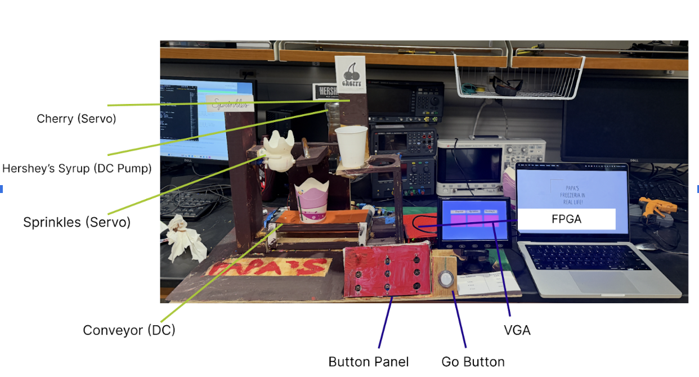
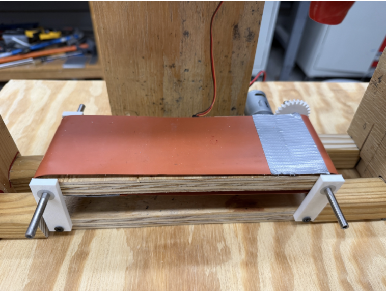
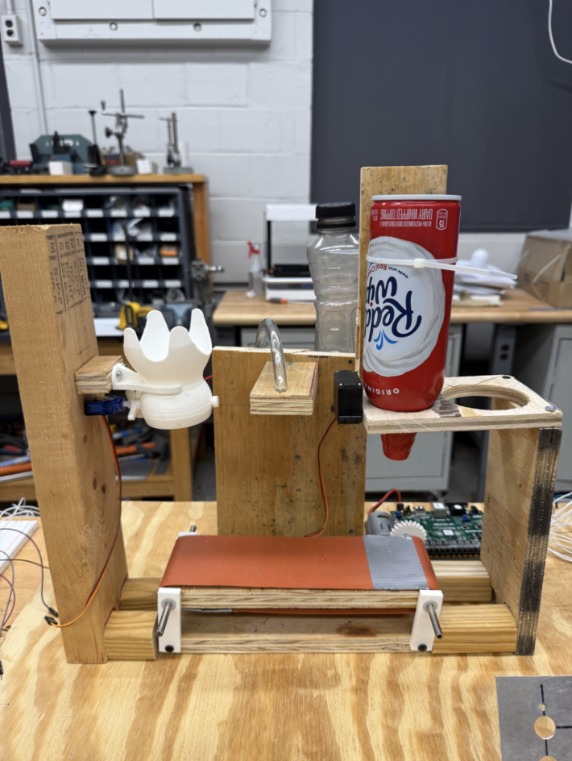

# Automated Ice Cream Topping Dispenser

*Complete system with conveyor belt, VGA display, and topping dispensers*

---

## What I Built

For my ECE 350 final project, my teammate and I built an automated ice cream topping dispenser controlled by a **custom 32-bit RISC CPU** that we designed in Verilog and implemented on a Nexys A7 FPGA. Users select their desired toppings (cherries, Hershey's chocolate sauce, and sprinkles) via external push buttons, and the system dispenses them in sequence using a conveyor belt, DC motors, and servo motors. The entire system is controlled by assembly code running on our custom processor with memory-mapped I/O.

**Technologies:** Custom 32-bit RISC CPU (Verilog), Nexys A7 FPGA, assembly programming, PWM generation, memory-mapped I/O, relay modules, servo motors, DC motors, VGA display

**Timeline:** Fall 2024 semester (ECE 350 Digital Systems) | **Team size:** 2 people

---

## Technical Design

### System Architecture

The system uses our custom CPU as the controller with memory-mapped I/O to interface with external hardware:

**Physical Components:**
- 2 DC motors (conveyor belt, chocolate sauce pump)
- 2 servo motors (cherry trap door, sprinkles shaker)
- 9 external push buttons (8 for topping selection, 1 GO button)
- 2 relay switches for DC motor control
- VGA display for visual feedback
- 3D printed mounts (conveyor, sprinkler dispenser, FPGA mount)

*FPGA architecture showing CPU, I/O decoder, and peripheral control*

### Memory Map

| Address | Function | Type | Description |
|---------|----------|------|-------------|
| 0x00000001 | Selection Buttons | Read | 9-bit button state (bits 0-8) |
| 0x00000002 | GO Button | Read | Single bit (inverted for active-low button) |
| 0x00000003 | Onboard LED's for Debugging | Write | 16-bit LED output register |
| 0x00000004 | Conveyor Motor | Write | Binary on/off control |
| 0x00000005 | Syrup Motor | Write | Binary on/off control |
| 0x00000006 | Sprinkles Servo | Write | 10-bit PWM duty cycle |
| 0x00000007 | Cherries Servo | Write | 10-bit PWM duty cycle |

---

## How I Built It

### CPU and Assembly Programming

The core of this system is our **custom 32-bit RISC processor** that we designed in Verilog. The CPU executes assembly code from block RAM that implements the entire control flow.

**Main program structure:**

1. **Selection Loop** - continuously read button inputs, decode using bit masking, update selection variables, and drive LEDs for visual feedback
2. **Validation** - ensure user has selected an option for all three toppings before allowing GO
3. **Dispensing Sequence** - activate each topping mechanism in order with precise timing:
   - Cherries dispense (servo opens trap door)
   - Conveyor moves for 2.5s
   - Hershey's sauce dispenses (DC pump runs 5s or 10s)
   - Conveyor moves for 2.5s
   - Sprinkles dispense (servo oscillates 2 or 4 cycles)

The assembly code uses **memory-mapped I/O** - reading button states and writing motor commands are just load/store instructions to specific memory addresses. No special I/O instructions needed.

*Physical layout showing all components integrated*

### PWM Generation for Servos

I implemented PWM in Verilog to control servo position:

**Sprinkles servo:**
- Range: 0° (rest) to 45° (shake)
- PWM duty cycle: 51 to 80 (out of 1024)
- Oscillates back and forth to shake sprinkles out

**Cherries servo:**
- Range: 0° (closed) to 180° (open)
- PWM duty cycle: 51 to 102
- Opens trap door to drop cherries

**PWM frequency:** 50Hz (standard for hobby servos)

The duty cycle values map to servo angles because servos interpret PWM pulse width as position. A 1ms pulse = 0°, 1.5ms = 90°, 2ms = 180°. With a 50Hz signal (20ms period), these correspond to 5-10% duty cycles.

### Relay Control for DC Motors

The DC motors (conveyor and syrup pump) run on 6V external power and are switched via relay modules:

- FPGA GPIO (3.3V logic) drives relay control input
- Relay switches 6V power to motor
- Conveyor: runs for exactly 2.5 seconds between stations
- Syrup pump: runs for 5s (small) or 10s (large)

Relays were necessary because the motors draw too much current to drive directly from FPGA pins.

### Timing Calibration

Getting the conveyor timing right was critical. If it moves too fast, toppings miss the cup. Too slow, and the system feels sluggish.

**Process:**
1. Measured physical distance between stations
2. Tested different conveyor run times
3. Found **2.5 seconds** was optimal to position cup under each dispenser
4. Implemented timing loops in assembly code

**Syrup dispensing calibration:**
- Small amount: **5 seconds** of pump runtime
- Large amount: **10 seconds**
- Issue: syrup continues dripping after pump stops (no valve in our pump)
- Solution: built in **10s delay** to let dripping finish before moving conveyor

**Sprinkles calibration:**
- Small: servo oscillates **2 cycles** (0° → 45° → 0°, twice)
- Large: servo oscillates **4 cycles**

### VGA Display

The VGA display provides real-time feedback on user selections:

**Selection mode:**
- Three colored squares (one per topping)
- Red = None/NO selected
- Yellow = Small amount selected
- Green = Large amount selected (or YES for cherries)

I wrote a separate Verilog module to handle VGA timing and pixel generation based on the current state from the CPU.

### Mechanical Design

We 3D printed several custom parts:
- Conveyor belt mounts
- Sprinkler dispenser mechanism
- FPGA mounting platform
- Servo holders

The physical layout was carefully designed so toppings dispense in the right order as the cup moves along the conveyor.

*Conveyor belt with 3D printed mounts*

*Topping dispenser mechanisms*

---

## How It Works

1. User selects toppings via button panel:
   - Hershey's sauce: None/Small/Large (buttons 0-2)
   - Sprinkles: None/Small/Large (buttons 3-5)
   - Cherries: NO/YES (buttons 6-7)
2. Selections display on VGA as colored squares and mirror to onboard LEDs
3. Once all three toppings selected, user presses GO button
4. System validates selections, then executes dispensing sequence:
   - **Cherries:** Servo opens trap door (or skips if NO selected)
   - **Conveyor moves** 2.5s
   - **Hershey's sauce:** Pump runs 5s or 10s (or skips if None)
   - **Wait 10s** for syrup dripping to finish
   - **Conveyor moves** 2.5s
   - **Sprinkles:** Servo oscillates 2 or 4 times (or skips if None)
5. System resets, ready for next user

---

## Results

The system successfully dispenses customized ice cream toppings with reliable timing and sequencing. The custom CPU runs the assembly program at **~100 cycles per button scan** with a 100MHz clock, giving roughly **1MHz scan rate** for responsive button input.

---

## Key Challenges Solved

### 1. Whipped Cream Dispenser Failure

**Problem:** Originally designed to use a servo to press a whipped cream nozzle, but the 9g servo lacked sufficient torque. We tried a bigger servo with 6V external power, but the PWM duty cycles we used for 3.3V servos didn't translate to the 6V servo.

**Solution:** Pivoted to a cherry trap door mechanism that works reliably with 3.3V servo power. This changed Topping A from 3 levels (None/Small/Large) to 2 levels (NO/YES), requiring updates to assembly code, button mapping, and VGA display.

### 2. Conveyor Belt Timing

**Problem:** Initial timing had toppings missing the cup or dispensing onto the conveyor belt. Hershey's syrup kept dripping after the pump stopped.

**Solution:**
- Calibrated conveyor run time through trial and error → **2.5 seconds optimal**
- Added **10 second wait** after syrup pump stops to allow dripping to finish
- Standardized cup size to ensure consistent positioning

---

## What I Learned

This project taught me how to design a **complete digital system from the ground up** - from logic gates in the CPU all the way to physical motors and user interaction.

The most valuable lesson was understanding **memory-mapped I/O at a deep level**. In software, you just call functions or use libraries. Here, I had to design the hardware decoder that maps memory addresses to specific I/O registers, write the Verilog to serialize data for PWM signals, and then write assembly code that treats hardware control as simple load/store operations. Seeing that abstraction layer work in practice was really satisfying.

I also learned about the **mechanical constraints** of interfacing digital systems with the real world. Timing in assembly is precise, but physical systems (motors, servos, dripping liquid) are messy. Calibration and testing with actual hardware is totally different from simulation.

**Hardware debugging** was challenging but educational. When a motor doesn't move, is it the assembly code? The Verilog decoder? The wiring? The relay? The power supply? I got much better at systematic troubleshooting by isolating each layer.

Finally, working with **servos and PWM** taught me how analog-like signals (duty cycles) can control physical position. Understanding the relationship between PWM frequency (50Hz), duty cycle (5-10%), and servo angle (0-180°) required both digital logic design and understanding the servo's internal control circuit.

---

## Future Improvements

**Hardware:**
- **Position sensors** - detect when cup reaches each station instead of hardcoded timing
- **Valve for syrup pump** - eliminate dripping issue
- **Reliable external buttons** - find better push buttons or use rotary switches

**System:**
- **VGA animations** - make the display more engaging during dispensing
- **Multiple cup sizes** - adjust timing based on cup height
- **Error handling** - detect if a topping runs out and alert user

---

## Skills Demonstrated

- Digital logic design - Custom 32-bit RISC CPU architecture in Verilog
- Computer architecture - 5-stage pipeline, ISA design, memory-mapped I/O
- Assembly programming - Low-level control flow, bit masking, timing loops
- FPGA development - Vivado, synthesis, timing constraints
- PWM generation - Servo control via duty cycle modulation
- Power electronics - Relay switching, multiple voltage domains
- Hardware integration - Motors, servos, buttons, VGA all interfacing with FPGA
- System debugging - Troubleshooting across digital logic, assembly code, and physical hardware
- Timing analysis - Calibrating real-world mechanical systems
- Full-stack embedded development - From CPU design to user interface

---

[← Back to Portfolio](/)
