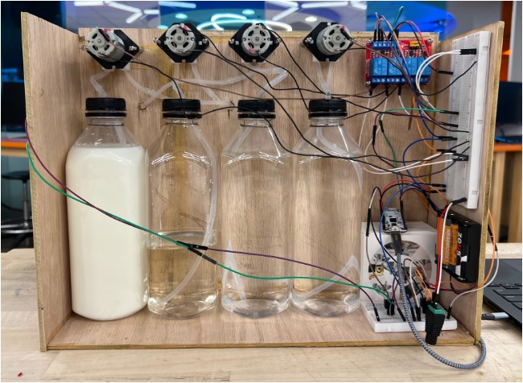
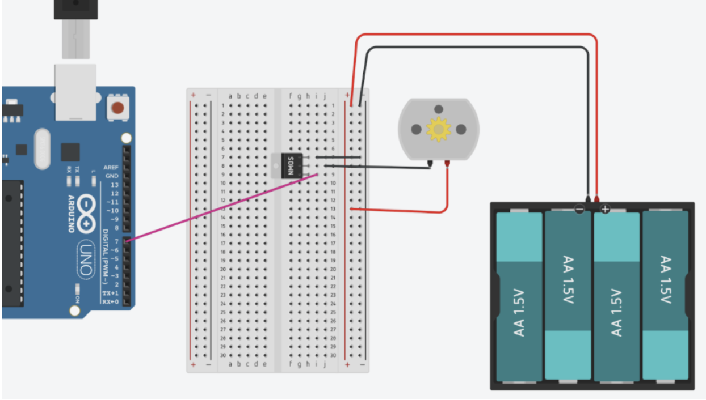
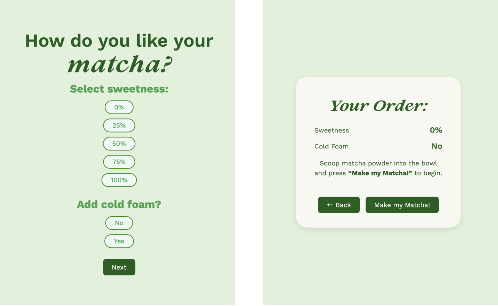

# Matchamatic: Automated Matcha Maker

*Automated matcha latte dispensing system with laser-cut enclosure*

*Electronics and pump configuration*

---

## What I Built

For my ECE 655 Full-Stack IoT Systems class, my teammate and I built the Matchamatic - an automated system that makes customized iced matcha lattes in 5-7 minutes. Users select their preferences on a web interface, and the system handles dispensing water, milk, and syrup through peristaltic pumps, while DC motors whisk the matcha and froth cold foam.

**Technologies:** ESP32-S3 microcontroller, MicroPython, 4-channel relay module, MOSFET circuits, 12V peristaltic pumps, 6V DC motors, HTML/CSS/JavaScript web interface

**Timeline:** Fall 2024 semester | **Team size:** 2 people

---

## Technical Design

### System Architecture

The system uses time-based dispensing controlled by an ESP32-S3:
- 3 peristaltic pumps (12V) for water, milk, and syrup
- 2 DC motors (6V) - one for whisking matcha, one for frothing cold foam
- 4-channel relay module to control the pumps
- MOSFET switching circuits to control the motors
- ESP32-hosted web server for user interface
- Laser-cut wooden enclosure with 3D printed components

---

## How I Built It

### Pump Calibration

Since we used time-based dispensing, I had to calibrate each pump by running it for exactly 1 minute and measuring output:

| Pump | Flow Rate (mL/sec) |
|------|-------------------|
| Water | 1.5 |
| Milk | 1.4 |
| Syrup | 0.6 |
| Creamer | 1.0 |

The syrup pump was slower because viscosity affects peristaltic pump flow rates. I did multiple test runs to ensure consistency (within ±0.1 mL/sec). With these flow rates, I could calculate exactly how long to run each pump for the desired volume. Example: 150 mL milk = 150 ÷ 1.4 = ~107 seconds.

### Motor Control Circuit

The ESP32 GPIO pins only output 3.3V, but the motors need 5-6V and higher current. I designed a MOSFET switching circuit:

- Used **IRLZ44N N-channel MOSFET** (logic-level)
- Motor positive → 6V battery pack
- Motor ground → MOSFET Drain
- MOSFET Source → ground
- ESP32 GPIO → MOSFET Gate (with 100kΩ pull-down resistor)

When GPIO goes HIGH, the MOSFET completes the circuit and the motor runs. When GPIO goes LOW, it stops. This safely controlled high-power motors with low-power signals.

### Relay Module for Pumps

The 12V pumps were controlled through a 4-channel relay module:
- 12V power supply → relay COM terminals
- Each pump positive → relay NO (normally open) terminal
- Pump grounds → common ground rail
- ESP32 GPIO pins → relay control inputs (IN1-IN4)

**Critical detail:** All grounds were tied together (ESP32, relay, MOSFET, batteries). Without a common ground, logic levels would float and cause unpredictable behavior.

### Mechanical Design

We laser-cut wood for the enclosure and 3D printed:
- Motor holders
- **Slider-crank mechanism** - converts motor rotation into linear motion to mimic traditional hand-whisking
- Faucets to hold tubing
- Bowl and cup holders

### Web Interface

I built a 5-page interface (HTML/CSS/JavaScript) hosted on the ESP32:

1. Welcome page
2. Customization - select sweetness (0%-100%) and cold foam (yes/no)
3. Review your order
4. Loading page
5. Done!

*User selects sweetness level and cold foam preference and sees review screen before starting*

---

## How It Works

1. User connects to WiFi and opens web interface
2. Selects sweetness level and cold foam preference
3. Places cup under faucet, scoops matcha into bowl
4. Clicks "Make My Matcha!"
5. Water dispenses into matcha bowl
6. Whisk motor runs for 2 minutes (slider-crank moves whisk back and forth)
7. Milk dispenses into cup
8. Syrup dispenses based on sweetness selection
9. If cold foam selected: frother motor runs for 1 minute
10. User pours matcha into cup and enjoys!

---

## Results

The system successfully makes customized matcha lattes in 5-7 minutes. Time-based calibration was reliable: volumes stayed consistent within ±5 mL across multiple tests.

---

## Key Challenges Solved

### 1. Motor Voltage Mismatch
- **Problem:** ESP32 outputs 3.3V, motors need 5-6V
- **Solution:** MOSFET switching circuit with external battery

### 2. Concurrent Web Display + Motor Control
- **Problem:** Single-threaded MicroPython would freeze the webpage
- **Solution:** JavaScript async requests to keep UI responsive

---

## What I Learned

This project taught me about managing different power domains in embedded systems. High-power actuators need separate supplies with proper isolation from control circuits. The MOSFET design was a perfect example.

I also learned that calibration is critical for real-world hardware. The pump flow rates depended on viscosity, tubing length, and voltage, understanding these relationships made the system reliable.

The mechanical integration (laser cutting, 3D printing, soldering) gave me hands-on experience translating electrical designs into physical products.

---

## Skills Demonstrated

- Power electronics (MOSFET circuits, relay control, multiple voltage domains)
- Embedded systems (ESP32 GPIO, MicroPython, real-time control)
- Hardware characterization (flow rate calibration, understanding viscosity effects)
- System integration (mechanical + electrical + software)
- Debugging (systematic troubleshooting of voltage, grounding, timing issues)
- Full product development (from concept to working prototype)

---

## Future Improvements

**Hardware:**
- **Load cell integration** - Automatically weigh matcha powder and calculate optimal water/milk ratios instead of fixed amounts
- **Flow sensors** - Verify dispensed volumes in real-time rather than relying on time-based calibration
- **Custom 3D printed pump holders** - Reduce vibration and improve maintainability

**Mechanical:**
- **Vertical design with automatic pouring** - Servo-controlled tilting platform so matcha pours directly into cup
- **Refrigeration** - Small Peltier cooler to keep milk/creamer cold

**System:**
- **Parallel processing** - Run whisking and dispensing simultaneously to reduce time from 5-7 min to 3-4 min
- **Recipe database** - Support hot matcha, different milk alternatives, size options
- **Ingredient level monitoring** - Sensors to detect when bottles are running low

The most impactful upgrade would be the load cell for adaptive ingredient ratios based on actual matcha powder weight.

---

[← Back to Portfolio](/)
