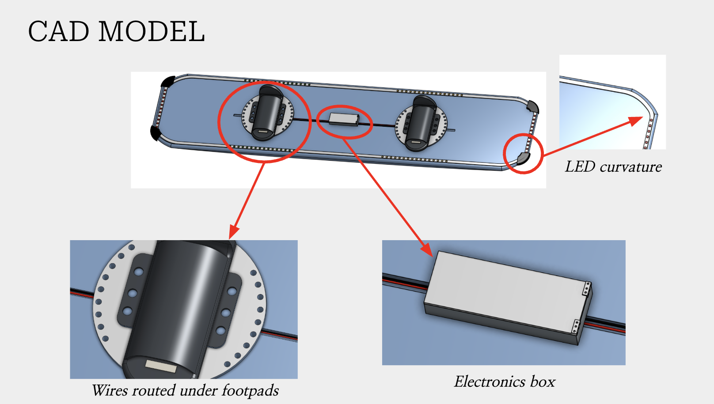
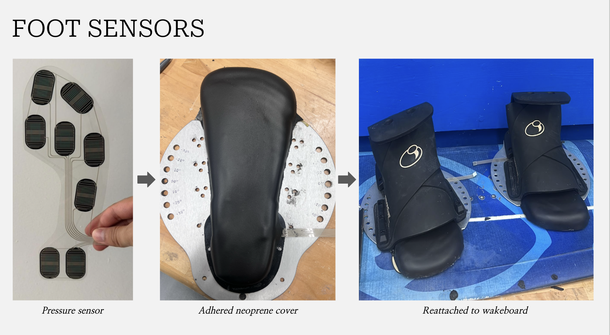
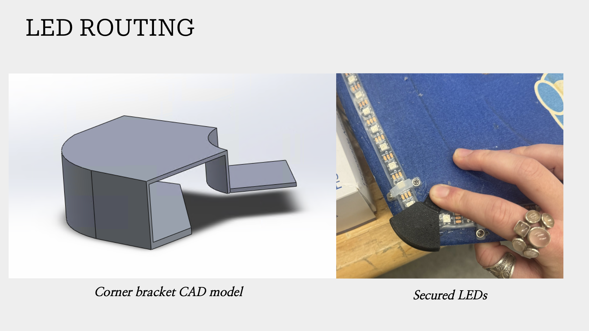
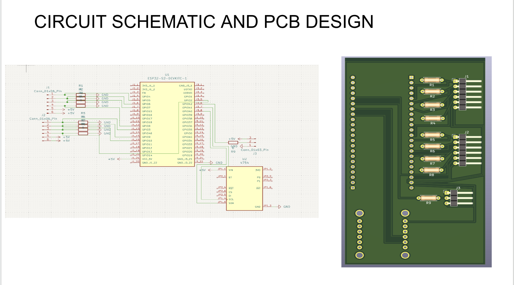
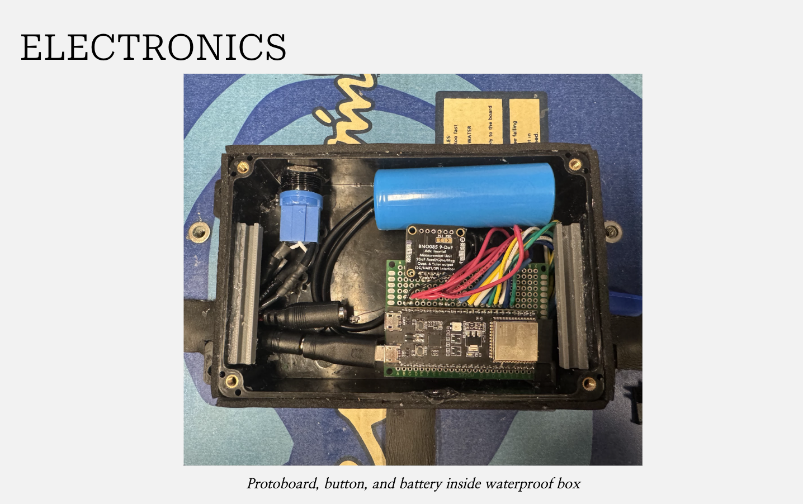
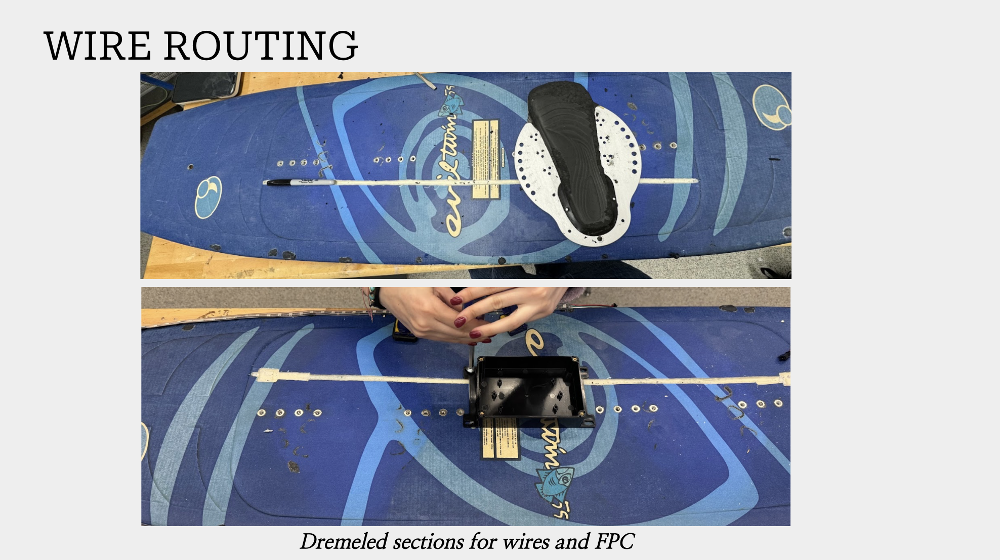
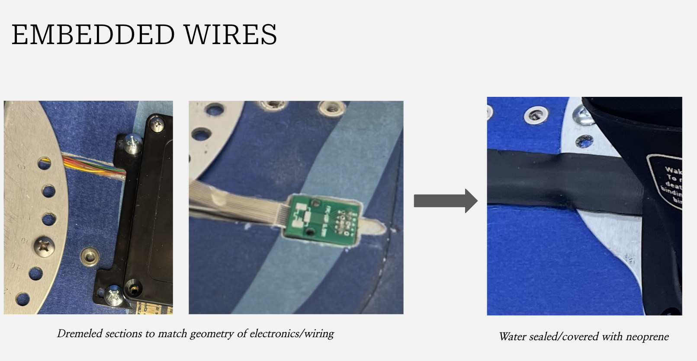
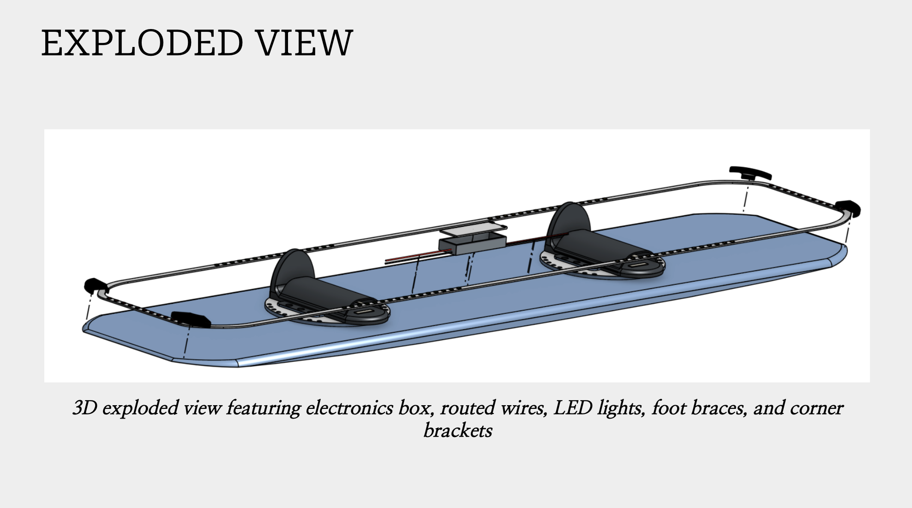
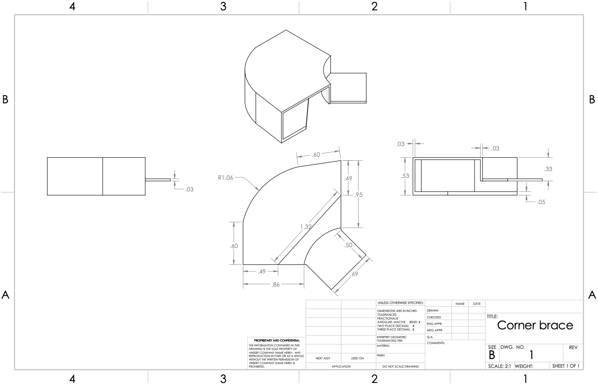

# WavGuard: Wakeboard Balance Training System

*Finished WavGuard wakeboard with LED strips and padded boots*

---

## What We Built

In a team of 5, we designed WavGuard: a live visual feedback system to help beginner wakeboarders learn how to balance on the water. The product features LED lights for instant pressure feedback and uses both Force-Sensitive Resistors (FSRs) and an IMU to verify proper technique. All components are fully padded for comfort, creating a safe and responsive training experience.

**Technologies:** ESP32, FSR pressure sensors, 6-axis IMU accelerometer, Waterproof WS2812B addressable LED strips, Custom PCB design (functional prototype), C++ (Arduino framework), IP65 waterproof enclosure

**Role:** Electronics and firmware - Designed sensor integration, implemented ratio-based tilt-pressure logic with training zones, developed LED feedback system, created custom PCB (functional but power issues prevented final integration)

---

## Why We Made This

Learning to wakeboard is hard. Beginners struggle with weight distribution. You need to keep your weight centered and balanced, but on the water, you can't see what you're doing wrong. Instructors can yell corrections, but by the time you hear them, you've already fallen.

We wanted to give beginners **instant, real-time feedback** they could feel and see. LED lights that show exactly where their pressure is and whether it matches proper technique for the current board tilt.

---

## Technical Design

### System Architecture

**Product Features:**

| Component | Description |
|-----------|-------------|
| **Foot Sensors** | Force-resistive pressure sensors embedded in the boots and epoxied down; wiring routed through Dremeled channels in the board |
| **IMU** | Placed in the center electronics box to measure board tilt and angle |
| **Corner Brackets** | Custom brackets added to protect board corners and LED strip edges from impact |
| **LED Strips** | Waterproof, individually addressable LED strips mounted around the board |
| **Silicone Sealant** | RTV silicone and marine-grade sealant used to attach LEDs, seal joints, and waterproof wiring entry points |
| **Electronics Box** | IP65 waterproof ABS enclosure with O-ring seal; houses ESP32, IMU, FSR circuitry, and LED resistors. Mounted using threaded inserts for secure attachment |
| **Neoprene Padding** | ¼" neoprene padding protects foot sensors, seals wiring areas, and adds user comfort |

*CAD model showing wires routed under footpads, electronics box, and LED curvature*

---

## How We Built It

### Sensor Integration

**FSR Pressure Sensors (8 total):**

We embedded **8 FSR sensors** into the wakeboard boots, distributed across heel and toe positions for both feet. FSRs are resistive sensors that change resistance when pressure is applied.

*Pressure sensors, adhered neoprene cover, and reattached to wakeboard*

**6-Axis IMU Integration:**

The IMU measures board tilt and angle to determine proper technique.

**Mounting:**
- Placed in center electronics box to measure overall board orientation
- I²C communication with ESP32
- Secured in IP65 waterproof enclosure

**Calibration:**
- Established "neutral" position for proper wakeboard stance
- Implemented tilt angle thresholds for different training zones

### Ratio-Based Tilt-Pressure Logic

The system uses **ratio-based logic** so it works for any person regardless of weight. It compares the **relationships between sensors** rather than absolute pressure values.

**Core Algorithm:**

I implemented **linear interpolation** to map tilt angle to expected pressure ratio:
- If you're tilted 15° toe-side → system calculates you SHOULD have ~70% weight on toes
- Compares expected ratio to actual pressure distribution from sensors
- Determines if tilt and pressure agree

**Three Training Zones:**

1. **Flat to 8°** - Basic Balance Mode
   - Teaches fundamental balance
   - Checks if each part of foot has equal weight relative to other parts
   - Shows green when everything's balanced

2. **8° to 20°** - Edge Commitment Mode
   - Tilt-pressure agreement logic activates
   - Teaches you to match weight distribution to board angle
   - Linear interpolation maps tilt → expected pressure ratio

3. **22°+** - Safety Warning Mode
   - Big red warnings to prevent falls
   - Exceeds safe lean angle

**LED Feedback:**
- **Red:** Regions receiving too much pressure
- **Blue:** Regions receiving too little pressure
- **Green:** System detects correct IMU response + fully balanced + right pressure at specific tilt angle

### LED System Design

**WS2812B Addressable LED Strips:**

**Early iteration challenges:**
- Tried spliced joints → too many failure points (any exposed wire could compromise circuit)
- Transitioned to **continuous LED strip**
- Designed **custom corner brackets** to protect folds needed to follow board's curved shape

*Corner bracket CAD model and secured LEDs around board edge*

**Final implementation:**
- Waterproof LED strips mounted around board perimeter
- Protected by corner brackets from impact damage
- RTV silicone and marine-grade sealant for waterproofing

**Wiring:**
- Data pin → ESP32 GPIO
- 5V power from battery
- Current-limiting resistors for LED protection

### Custom PCB Design

We designed a custom PCB to integrate all electronics:

**PCB features:**
- ESP32 footprint with power regulation
- 8 FSR input channels with voltage dividers
- I²C breakout for IMU connection
- LED data output with current limiting
- Compact form factor to fit in IP65 enclosure

*Circuit schematic and custom PCB design*

**Status:** PCB was **fully functional** during testing, but encountered **power issues** that prevented integration into the final product. The final product used a clean protoboard implementation in the electronics box.

### Mechanical Design & Waterproofing

**Electronics Enclosure:**
- **IP65 waterproof ABS enclosure** with O-ring seal
- Mounted using **threaded inserts** for secure attachment
- Houses ESP32, IMU, FSR circuitry, LED resistors

*Protoboard, battery, and battery inside waterproof box*

**Wire Routing:**
- **Dremeled channels** in board for clean wire runs
- Wires routed through channels, then sealed with neoprene padding
- All entry points sealed with RTV silicone and marine-grade sealant

*Dremeled sections for wires and FPC*

*Dremeled sections to match geometry of electronics/wiring, water sealed/covered with neoprene*

---

## How It Works

1. **User straps into wakeboard** with WavGuard system installed
2. **8 FSR sensors detect pressure** distribution across both feet
3. **IMU measures board tilt** (roll, pitch)
4. **ESP32 runs ratio-based algorithm:**
   - Determines which training zone (flat, edge commitment, safety warning)
   - Compares sensor pressure ratios to expected ratios for current tilt
   - Calculates which regions have too much/too little pressure
5. **LED strips light up** with color-coded feedback (red/blue/green)
6. **User adjusts stance** based on LED colors
7. **System updates** continuously for real-time training

*3D exploded view featuring electronics box, routed wires, LED lights, foot braces, and corner brackets*

---

## Results

Successfully created a working prototype that provides real-time balance feedback for wakeboard training.

**What worked:**
- Ratio-based tilt-pressure algorithm successfully detected improper form
- LED feedback was visible and intuitive during testing
- IP65 enclosure protected electronics during water testing
- FSR sensors provided accurate relative pressure readings
- IMU tilt tracking was stable and responsive
- Continuous LED strips with corner brackets eliminated failure points

**Testing:**
- Pool simulations with simulated wake and rope forces
- Hose-generated forces to test waterproofing
- Water testing validated sensor accuracy and LED visibility
- User testing confirmed feedback was intuitive

<video width="100%" controls style="border-radius: 8px; margin: var(--spacing-lg) 0;">
  <source src="../images/wavguard/water-testing.mp4" type="video/mp4">
  Your browser does not support the video tag.
</video>
*Final wakeboard in water test with simulated wake and rope*

*Technical drawings of corner bracket and final assembly*

---

## What I Learned

This project taught me about **iterative hardware design**. We found ourselves repeatedly revisiting and refining major design elements as new challenges emerged. This cycle of testing, failure, and redesign ultimately strengthened the final outcome.

**Ratio-based sensing** was a key insight. By comparing sensor relationships rather than absolute values, the system works for users of any weight. This taught me to think about algorithmic approaches that generalize across use cases.

I learned about **waterproofing in extreme environments**. Pool simulations and hose tests helped, but they cannot replicate full wakeboarding conditions. Proper sealing (O-rings, RTV silicone, marine-grade sealant) and wire management (Dremeled channels, strain relief) were critical.

**Incremental testing** is essential. We learned to test components individually before integrating them, validate assemblies before final installation, and use cleaner schematics for troubleshooting. Early mistakes (pulled wires, fried components) taught us these lessons.

**PCB design challenges** showed me the importance of thorough power supply testing under load conditions before committing to a full board assembly. The functional PCB that failed due to power issues taught me to validate critical subsystems independently.

Finally, **real-world testing matters**. While we simulated wakeboarding dynamics, the next phase requires actual on-water testing with riders to collect true performance data and validate the system under real forces.

---

## Skills Demonstrated

- Embedded systems - ESP32 programming, ADC reading, I²C communication
- Sensor integration - 8 FSR pressure sensors, 6-axis IMU, ratio-based fusion
- Algorithm development - Ratio-based pressure logic, linear interpolation, three-zone training system
- PCB design - Schematic capture, layout, troubleshooting (functional prototype)
- Power electronics - Battery management, voltage regulation, LED driver circuits
- Waterproofing - IP65 enclosures, O-ring seals, RTV silicone, marine-grade sealant
- Mechanical fabrication - Dremel work for wire channels, threaded insert installation
- User testing - Pool simulations, iterative design based on feedback
- System integration - Combining sensors, microcontroller, LEDs, power into waterproof product
- Debugging - Systematic troubleshooting of wiring, component failures, waterproofing
- Iterative design - Testing, failure analysis, redesign cycles

---

[← Back to Portfolio](/)
